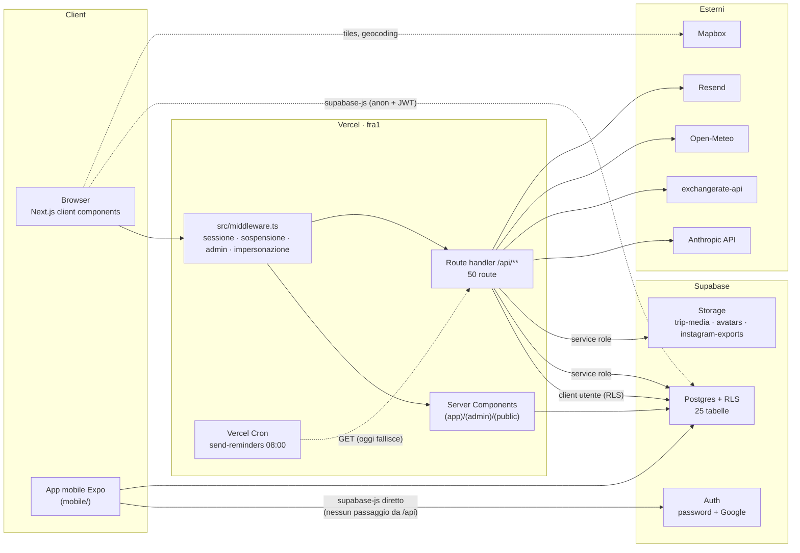
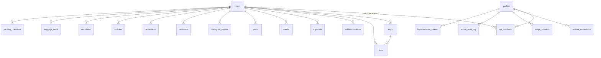
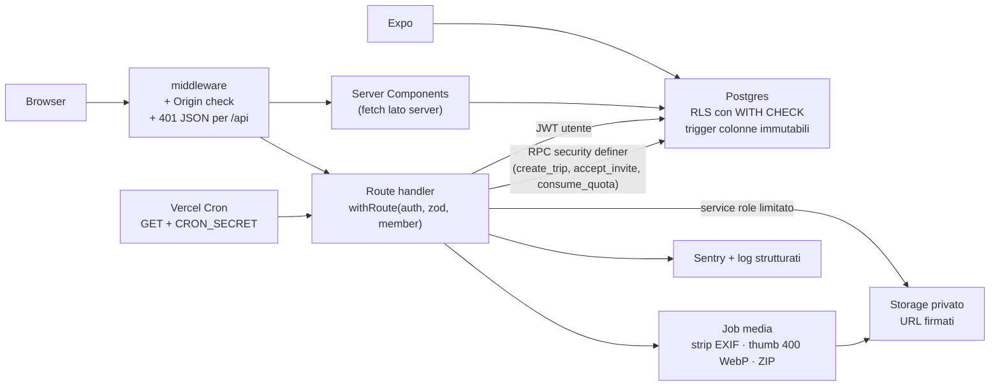

# architecture.md — motonui

> Baseline: commit `483599c` (29/09/2026). Il documento descrive prima l'architettura **com'è** (verificata sul codice), poi le differenze rispetto a `CLAUDE.md` e infine l'architettura **obiettivo** con le decisioni che la guidano. Sostituisce `docs/ARCHITECTURE.md`, che descrive una struttura non più aderente al codice (gruppi `(auth)`, `components/ui`, magic link).

---

## 1. Mappa dell'architettura attuale

### 1.1 Vista d'insieme



Punti chiave che la mappa rende visibili:

1. **Esistono due canali verso il database.** Il web passa in parte dalle API Next.js, ma sia il browser (client components con `supabase-js`) sia l'app mobile interrogano Postgres direttamente con anon key + JWT dell'utente. La RLS è quindi l'unico confine reale: qualunque cosa la RLS consenta, un utente la può fare saltando validazione e logica delle API.
2. **Il service role è usato in percorsi utente**, non solo in quelli admin: creazione viaggio (`api/trips` POST), upload/URL/cancellazione file (`lib/storage.ts`), quote premium (`lib/premium/access.ts`), avatar.
3. **Lo storage restituisce URL pubblici** per foto, carte d'imbarco e documenti.

### 1.2 Livelli applicativi

| Livello | Dove | Stato |
|---|---|---|
| Routing e protezione | `src/middleware.ts`, `src/lib/supabase/middleware.ts` | Refresh sessione, redirect login, blocco sospesi, gate `/admin`, sola lettura in impersonazione. Reindirizza anche le API (vedi SR-AUTH-05). |
| Pagine | `src/app/(app)`, `(admin)`, `(public)`, `auth/` | 16 pagine. Il blog pubblico sta in `(app)/blog` ed è reso pubblico da un'eccezione nel middleware. |
| API | `src/app/api/**` | 50 route: `trips/**` (30), `admin/**` (12), `ai/*` (3), `profile/*` (3), `posts/[slug]`, `expenses/[id]`, `instagram/generate`. |
| Dominio | `src/lib/*.ts` | `expenses.ts` (conversione e split), `trips.ts` (statistiche), `authz.ts`, `sanitize.ts`, `storage.ts`, `errors.ts`, `premium/access.ts`, `reminders.ts`, `weather.ts`, `email.ts`. |
| AI | `src/lib/ai/*` | blog assistant (streaming SSE), destinazione, packing, SEO, riepilogo viaggio, caption. |
| Media | `src/lib/media/*` | `process.ts` (sharp: crop, filtri, overlay), `instagram-export.ts` (ZIP), `upload.ts`, `captions.ts`. La pipeline non è collegata all'upload. |
| Dati | `supabase/migrations` 0001–0015 | 25 tabelle, tutte con RLS; helper `is_trip_member`, `is_trip_owner`, `delete_my_account`. |
| UI | `src/components/*` (31 componenti) | Tab del viaggio, drawer, mappa, calendario, wallet, admin. Nessuna libreria di primitive (`components/ui` non esiste). |
| Mobile | `mobile/` (Expo Router) | Login, lista viaggi, dettaglio, blog, profilo, cancellazione account. Token in SecureStore su nativo, `localStorage` su web. |
| CI/CD | `.github/workflows` | `ci.yml` (gitleaks, RLS, `npm audit` prod, lint, tsc, test+coverage, build), `deploy-preview.yml`, `deploy-production.yml` (dopo CI verde su `main`: `supabase db push`, poi Vercel CLI). Azioni fissate per SHA, `dependabot.yml`. |

### 1.3 Modello dati



Tabelle di supporto senza relazione diretta: `currency_rates`, `destination_cache`, `weather_cache`, `ai_usage`, `feature_controls`. Vista: `admin_user_view` (join con `auth.users`).

### 1.4 Flusso di una richiesta tipica (oggi)

```
Browser ──► middleware (getUser, profilo, impersonazione)
        ──► route /api/trips/[id]/expenses
              createClient()            client con JWT utente
              getAuthUser()             401 se assente (ma il middleware ha già reindirizzato)
              Zod safeParse
              requireTripMember()       presente in 19 route su 30
              query Supabase            RLS is_trip_member
              convertCurrency()         exchangerate-api, cache 24h
        ◄── withErrorHandler            errore standard { error, code, status }
```

### 1.5 Stato rispetto ai criteri di accettazione

| Criterio (`CLAUDE.md`) | Stato | Evidenza |
|---|---|---|
| `npm run dev` parte | ✅ | `predev` esegue i test (181 passano) |
| Registrazione e viaggio **insieme** | 🔴 | La pagina chiama `POST /api/trips/invite` (`trips/new/page.tsx:112`), che non esiste. Nessun modo per aggiungere il partner. |
| Giorni, tappe, alloggi | ✅ | route `days`, `legs`, `accommodations` + drawer |
| Spese e "chi deve quanto a chi" | 🟡 | `splitExpenses` funziona per 2 membri, ma senza secondo membro non c'è saldo; fallback valuta errato |
| Upload foto e griglia | 🟡 | Upload e `MediaTab` presenti; niente thumbnail, niente EXIF strip, bucket pubblico |
| Carousel ZIP Instagram | 🔴 | API presente, nessuna UI (`components/instagram` assente); ZIP mai cancellati |
| Scrivere e pubblicare un post | ✅ | `PostEditor`, route `posts` |
| Blog pubblico senza login | ✅ | `/blog` pubblico nel middleware; manca `/api/sitemap` referenziato in `vercel.json` |
| CI verde | 🟡 | tsc 0 errori, test verdi, lint 306 warning, coverage `src/lib` 29,6% contro 70% |
| Deploy Vercel | 🟡 | Workflow presente ma senza gate sulla CI e con ordine codice → migration |

---

## 2. Differenze tra `CLAUDE.md` e il codice

| Tema | `CLAUDE.md` dice | Il codice fa | Azione |
|---|---|---|---|
| Posizione del file | radice del repo | `docs/CLAUDE.md` | Spostarlo in radice: Claude Code lo carica automaticamente solo da lì. |
| Co-fondatrice | "Nicolò e Sara" | — | Correggere in **Giorgia** (CLAUDE.md, seed, testi). |
| Auth | magic link + Google | password + Google | Aggiornare CLAUDE.md o implementare il magic link (decisione ADR-06). |
| Primitive UI | shadcn/ui, `components/ui` | assenti | Introdurle o togliere la regola. |
| Fetching | niente `useEffect`, usare RSC o SWR/React Query | 29 file fanno fetch in `useEffect`; SWR/React Query non installati | Vedi ADR-05. |
| Tipi | zero `any`, tipi generati | 97 `any`; `createServerClient<any>` | Rigenerare `database.types.ts` e tipizzare i client. |
| File ≤ 300 righe | obbligatorio | 11 file oltre (max `LegDrawer.tsx` 647) | Refactoring progressivo. |
| Modelli AI | `claude-haiku-4-5`, `claude-sonnet-4-6` | `claude-sonnet-4-5` in blog e riepilogo | Centralizzare i model id in `lib/ai/models.ts`. |
| Limite AI | 20 chiamate/giorno/utente | due sistemi: 200/50/10 e 30/10/20… | Vedi ADR-04. |
| Admin, premium, mobile, packing, prenotazioni | non menzionati | presenti | Aggiornare CLAUDE.md e l'ordine delle fasi (esiste già `agents/07_ADMIN.md`). |
| Branch `main` protetto | sì | storia con commit diretti (es. `de3ed8e update files`) | Verificare la branch protection su GitHub. |

---

## 3. Architettura obiettivo

### 3.1 Principi

1. **La RLS è il contratto, le API sono comodità.** Tutto ciò che la RLS permette va considerato raggiungibile da un utente malintenzionato con la propria sessione. Le policy devono quindi avere sempre `WITH CHECK` e le colonne strutturali devono essere immutabili a livello di DB.
2. **Service role solo dove serve davvero.** Ammesso in: route admin, cron, generazione URL firmati, operazioni che richiedono atomicità (tramite funzioni RPC `SECURITY DEFINER` con controlli interni). Mai per scavalcare una RLS scritta male.
3. **Dati privati di default.** Bucket privati, URL firmati a breve durata, EXIF rimossi, blog come unica superficie pubblica.
4. **Un solo punto per ogni responsabilità trasversale:** quote AI, logging, errori, model id, validazione degli ID di percorso.

### 3.2 Vista obiettivo



### 3.3 Moduli da introdurre

| Modulo | Responsabilità |
|---|---|
| `src/lib/api/with-route.ts` | Compone `withErrorHandler`, `getAuthUser`, parsing Zod di params/query/body e `requireTripMember`. Ogni route diventa una dichiarazione: schema + handler. |
| `supabase/migrations/0016_security_hardening.sql` | `WITH CHECK` su tutte le policy UPDATE, trigger di immutabilità colonne, fix `profiles`, `REVOKE` su `admin_user_view`, `search_path` sulle funzioni, limite 2 membri. |
| `supabase/migrations/0017_invites.sql` | Tabella `trip_invites` (token hash, scadenza, email destinatario) e RPC `accept_trip_invite`. |
| `supabase/migrations/0018_private_storage.sql` | Bucket privati, policy su `storage.objects` per `trips/{trip_id}/…`, rimozione di `url` a favore di `storage_path`. |
| `src/lib/ai/quota.ts` + RPC `consume_ai_quota` | Un'unica quota atomica (`UPDATE … RETURNING`), 20/giorno, tabella scrivibile solo dal service role. |
| `src/lib/ai/models.ts` | Model id centralizzati. |
| `src/lib/media/pipeline.ts` | Upload → strip EXIF → originale privato + thumbnail 400×400 WebP → riga `media` con `storage_path` e `thumb_path`. |
| `src/lib/http/safe-fetch.ts` | `fetch` con timeout, allowlist di host e limite di dimensione. |
| `src/lib/redirect.ts` | `safeRedirectPath()` usato da login e callback. |
| `instrumentation.ts` + `sentry.*.config.ts` | Inizializzazione Sentry reale. |
| `supabase/tests/*.sql` (pgTAP) o `tests/rls/*.test.ts` | Test RLS con utenti anonimo, estraneo, partner. |

---

## 4. Decisioni architetturali (ADR)

**ADR-01 — Postgres/RLS come confine di sicurezza primario.** L'app mobile e i client component parlano direttamente con Supabase: non esiste un modo economico per forzare tutto il traffico dalle API. Conseguenza: ogni policy UPDATE/INSERT deve avere `WITH CHECK`, le colonne strutturali sono protette da trigger e le policy si testano automaticamente.

**ADR-02 — Creazione viaggio e invito tramite RPC transazionali.** `api/trips` POST oggi usa il service role e due insert non atomici (una membership fallita lascia un viaggio orfano). Si sostituisce con `create_trip(...)` e `accept_trip_invite(token)` `SECURITY DEFINER`, che controllano `auth.uid()` e il limite di due membri nella stessa transazione.

**ADR-03 — Storage privato con path, non URL.** Il DB salva `storage_path` e il server genera URL firmati (TTL 1h per la UI, 24h per gli ZIP). Le cancellazioni usano solo path ricostruiti da `trip_id` + id del record, mai stringhe fornite dal client.

**ADR-04 — Quota AI unica e atomica.** Si elimina il limiter `ai_usage` scrivibile dall'utente e si tiene un solo contatore server-side, con incremento atomico prima della chiamata e limite configurabile (default 20/giorno come da CLAUDE.md; il piano premium può alzarlo via `feature_entitlements`).

**ADR-05 — Fetching: Server Components prima, SWR per l'interattività.** Si installa SWR (più leggero di React Query, sufficiente per un'app a due utenti) e si migra progressivamente il fetch in `useEffect`, partendo dai tab del viaggio.

**ADR-06 — Metodo di login.** Si mantiene email+password + Google (già in produzione e usato dal mobile) e si aggiorna `CLAUDE.md`. Il magic link può tornare come opzione aggiuntiva, non come sostituto.

**ADR-07 — Impersonazione: sola visualizzazione via API admin.** Oggi il token non cambia identità (gli header vengono impostati sulla risposta e nessuno li legge). Invece di completare un'impersonazione "vera", che richiederebbe di emettere sessioni per conto dell'utente, si mantiene una vista admin in sola lettura (`/api/admin/trips/[id]`) e il cookie serve solo per banner e blocco scritture, con revoca verificata tramite `jti`.

**ADR-08 — Deploy: migration prima del codice, dopo CI verde.** Il workflow di produzione dipende dalla CI, applica le migration (retrocompatibili) e poi pubblica il codice. Supabase CLI e azioni sono fissati a versione/SHA.
