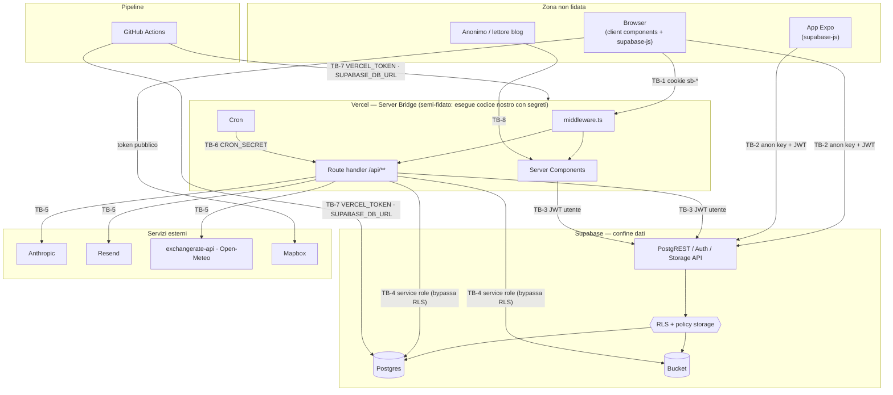

# 03 — Security Architecture

> motonui · baseline commit `483599c` (29/09/2026). Per ogni elemento è indicato lo stato attuale e quello obiettivo; gli obiettivi rimandano ai task di `docs/tasks.md`.

---

## 1. Confini di fiducia

**Regola di lettura:** tutto ciò che entra in `GW` passa per la RLS, tranne le chiamate con service role (TB-4). Le frecce TB-2 esistono e continueranno a esistere (mobile, client component): la RLS è quindi il controllo che deve reggere da solo.

---

## 2. Token e segreti

| Nome | Formato | Durata | Dove sta | Chi lo legge | Revoca | Stato / azione |
|---|---|---|---|---|---|---|
| Access token Supabase | JWT firmato da Supabase (claim `sub`, `role`, `exp`) | 1 h (`jwt_expiry = 3600`) | Cookie `sb-<ref>-auth-token` (web, gestito da `@supabase/ssr`); SecureStore (iOS/Android); `localStorage` (Expo web) | Middleware, route, PostgREST | Scade; logout; per revoca immediata `auth.admin.signOut(userId)` | ✅ |
| Refresh token Supabase | Stringa opaca | Fino a logout o rotazione (monouso) | Stesso cookie / SecureStore | Supabase Auth | Logout, sospensione (da collegare: T-1.x), cambio password | 🟡 La sospensione non revoca le sessioni esistenti |
| Anon / publishable key | JWT o `sb_publishable_…` | Fino a rotazione | Bundle client (`NEXT_PUBLIC_*`, `EXPO_PUBLIC_*`) | Tutti | Rotazione nel dashboard | ✅ Pubblica per design; non è un segreto |
| Service role / secret key | JWT o `sb_secret_…` | Fino a rotazione | Solo env server Vercel | `createAdminClient()` | Rotazione nel dashboard | 🟡 Usata anche in flussi utente (§4.3) |
| `ADMIN_IMPERSONATION_SECRET` | ≥ 32 byte casuali (HS256) | Fino a rotazione | Env server | Middleware, route impersonate | Rotazione (invalida tutti i token) | 🔴 **Pubblicato nel repo** → ruotare (T-0.1) |
| Token di impersonazione | JWT HS256 `{adminId, targetId, type, exp}` | 30 min | Cookie `impersonation_token` HttpOnly, Secure, SameSite=Lax; copia in `impersonation_tokens.token` | Middleware | `exit` cancella la riga, **ma il middleware non la controlla** | 🔴 Aggiungere `jti`, salvare hash, verificare revoca (T-1.8) |
| `impersonation_display_name` | Testo | 30 min | Cookie leggibile da JS | Banner UI | Con l'uscita | ✅ Non sensibile |
| `user_role` | `user`/`admin` | Sessione | Cookie leggibile da JS | UI | — | ✅ Solo suggerimento UI, mai usato per autorizzare |
| `CRON_SECRET` | Stringa casuale ≥ 32 caratteri | Fino a rotazione | Env Vercel | Route cron (`src/lib/auth/cron.ts`) | Rotazione | ✅ Header `Authorization: Bearer` inviato da Vercel Cron (T-2.6); `ADMIN_CLEANUP_SECRET` non è più usato |
| `ANTHROPIC_API_KEY` | `sk-ant-…` | Fino a rotazione | Env server | `lib/ai/*` | Console Anthropic | 🔴 **Nel repo** → ruotare |
| `NEXT_PUBLIC_MAPBOX_TOKEN` | `pk.…` | Fino a rotazione | Bundle client | Browser | Account Mapbox | 🟡 Pubblico per design ma va ristretto per URL; è anche nel repo |
| `EXCHANGE_RATE_API_KEY` | Stringa | Fino a rotazione | Env server | `lib/expenses.ts` | Dashboard provider | ✅ Placeholder nel repo |
| `RESEND_API_KEY` | `re_…` | Fino a rotazione | Env server | `lib/email.ts` | Dashboard Resend | ✅ |
| `SENTRY_DSN` / `SENTRY_AUTH_TOKEN` | URL / token | Fino a rotazione | DSN pubblico; token solo in CI | Sentry SDK / build | Dashboard Sentry | 🟡 Nomi incoerenti; token solo nel job di build |
| `SUPABASE_DB_URL` | Connection string con password | Fino a rotazione | GitHub secret (environment `production`) | Job migration | Reset password DB | ✅ Limitare all'environment protetto |
| `VERCEL_TOKEN` | Token personale | Fino a revoca | GitHub secret | `amondnet/vercel-action` | Dashboard Vercel | 🟡 Passato a un'action di terze parti non fissata per SHA |
| Token di invito (futuro) | 32 byte casuali, base64url | 7 giorni, monouso | Link email; nel DB solo SHA-256 | RPC `accept_trip_invite` | Scadenza / cancellazione | Da progettare (T-2.5) |
| URL firmati Storage (futuro) | URL con token Supabase | 1 h (UI), 24 h (ZIP) | Solo risposta API | Browser | Scadenza | Da introdurre (T-2.1) |

**Regole generali:** nessun segreto con prefisso `NEXT_PUBLIC_`/`EXPO_PUBLIC_`; nessun segreto nei log; ogni segreto ha un proprietario e una procedura di rotazione (SR-OPS-05); valori diversi per Development, Preview e Production.

---

## 3. Passaggi di autorizzazione

### 3.1 Livelli

| Livello | Dove | Cosa decide | Oggi |
|---|---|---|---|
| L0 — Edge/Header | `next.config.ts` | Politiche del browser (CSP, frame, HSTS) | ✅ con CSP da stringere |
| L1 — Middleware | `middleware.ts` | Autenticato? Sospeso? Admin per `/admin`? Impersonazione in sola lettura? | 🟡 Reindirizza anche le API; niente controllo `Origin` |
| L2 — Wrapper route | `withErrorHandler` → futuro `withRoute` | Utente, validazione di params/query/body, formato errori | 🟡 Applicato a mano, non ovunque |
| L3 — Autorizzazione applicativa | `src/lib/authz.ts`, `requireAdmin`, `requireFeatureAccess` | Membro del viaggio? Giorno/tratta/pagatore del viaggio giusto? Admin? Premium e quota? | 🟡 19 route su 30 per la membership |
| L4 — RLS | policy Postgres | Riga visibile/modificabile dall'utente del JWT | 🟡 Presente ovunque, ma senza `WITH CHECK` e con i buchi su `profiles` e viste |
| L5 — Policy Storage | `storage.objects` | Accesso ai file | 🔴 Bucket media pubblico |

### 3.2 Percorsi

| Percorso | Livelli attraversati | Note |
|---|---|---|
| Browser → `/api/trips/[id]/*` | L0 → L1 → L2 → L3 → L4 | Percorso "completo"; va reso uniforme con `withRoute` |
| Browser → Server Component | L0 → L1 → L4 | Nessun L3: la RLS deve bastare |
| Browser/Mobile → Supabase REST | **solo L4/L5** | Percorso più esposto; determina il vero livello di sicurezza |
| Admin → `/api/admin/*` | L1 → `requireAdmin` → service role | Nessuna RLS dopo `requireAdmin`: il controllo del ruolo deve essere inattaccabile (dipende da SR-AUTHZ-04) |
| Cron → `/api/admin/send-reminders`, `cleanup` | L1 (esclusione esplicita) → segreto → service role | Oggi bloccato dal middleware e dal metodo HTTP |
| Anonimo → `/blog`, `/api/posts/[slug]` | L0 → L1 (pubblico) → L4 (`posts_select_published`) | Colonne selezionate esplicitamente |

### 3.3 Regole per l'uso del service role

Il service role è ammesso solo se **tutte** queste condizioni valgono:
1. l'operazione non è esprimibile con il JWT dell'utente (admin, cron, URL firmati, operazioni cross-utente non esprimibili con una RPC `SECURITY DEFINER`; l'accettazione di un invito usa `accept_trip_invite()`, non il service role);
2. prima della chiamata la route ha verificato identità e autorizzazione (L2 + L3);
3. gli identificatori usati (path, id) sono costruiti dal server, mai presi da colonne che l'utente può scrivere;
4. l'operazione è coperta da test.

Usi attuali da rivedere: `api/trips` POST (sostituire con RPC `create_trip`), `storage.uploadFile/deleteFile` (path da `storage_path` server-side), `profile/avatar` (ok, path per `user.id`), `premium/access` (ok, lettura/scrittura contatori).

---

## 4. Limiti del Bridge

Nel codice non esiste un componente chiamato "Bridge". In questo documento il termine indica lo **strato server Next.js** (middleware, route handler, server components, cron) che fa da ponte tra i client e le risorse privilegiate: service role, chiavi esterne, storage. Se "Bridge" si riferisce a un componente diverso previsto per il futuro, questa sezione va rivista.

### 4.1 Cosa il Bridge garantisce
- Le chiavi di servizio (service role, Anthropic, Resend, cron) non lasciano mai il server.
- Validazione, formato errori, quote e controlli di membership per il traffico che passa da `/api`.
- Operazioni che richiedono privilegi elevati eseguite dopo un controllo esplicito (§3.3).

### 4.2 Cosa il Bridge **non** garantisce
- **Non è l'unico accesso ai dati.** Il mobile e i client component parlano con Supabase direttamente: una regola scritta solo nelle API (es. "il pagatore deve essere membro", "massimo 2 membri", sanificazione del blog) non protegge nulla se la RLS permette il contrario. Ogni invariante di sicurezza va quindi espressa anche nel DB (policy, trigger, vincoli, RPC).
- **Non isola i viaggi quando usa il service role:** in quel caso l'isolamento dipende al 100% dal codice della route.
- **Non protegge dai segreti trapelati:** chi ha la service role key parla con Supabase senza passare dal Bridge.

### 4.3 Limiti tecnici della piattaforma
| Limite (Vercel Functions) | Effetto su motonui | Contromisura |
|---|---|---|
| Corpo della richiesta ~4,5 MB | L'upload fino a 50 MB via `/api/trips/[id]/media` fallisce in produzione per file grandi (foto HEIC e video) | Upload diretto allo storage con `createSignedUploadUrl`, poi elaborazione server-side del file caricato (T-2.2) |
| Durata massima della funzione (piano dipendente) | Export Instagram di 10 foto con `sharp` dentro la richiesta rischia il timeout | Job asincrono con stato (T-2.7) |
| Memoria per funzione | `sharp` su immagini grandi | `limitInputPixels`, elaborazione sequenziale |
| Numero e frequenza dei cron | Promemoria e pulizia giornalieri | Un cron giornaliero per ciascuno, idempotenti |
| Middleware su runtime edge | Niente `sharp`/Node API, latenza sulle query | Il middleware legge solo sessione e profilo; niente logica pesante |

---

## 5. Crittografia

| Ambito | Meccanismo | Stato |
|---|---|---|
| In transito | TLS gestito da Vercel e Supabase; HSTS 2 anni con `includeSubDomains; preload` | ✅ |
| A riposo | Cifratura disco di Supabase (Postgres e Storage) | ✅ gestito dal provider |
| Password | Hash bcrypt gestito da Supabase Auth | ✅ |
| Sessioni | JWT firmati da Supabase; validati con `getUser()` lato server | ✅ |
| Token di impersonazione | HS256 via `jose`, segreto ≥ 32 byte, `exp` 30 min | 🟡 Aggiungere `jti` e hash SHA-256 in DB |
| Token persistiti (impersonazione, inviti) | Solo hash SHA-256 in DB; confronto sull'hash | 🔴 Oggi in chiaro |
| Segreti condivisi (cron) | Confronto `crypto.timingSafeEqual` su buffer di pari lunghezza | ✅ Digest SHA-256 confrontati con `timingSafeEqual` (`src/lib/auth/cron.ts`) |
| Casualità | `crypto.randomUUID()` / `crypto.getRandomValues` | ✅ Nomi file upload |
| URL firmati | Firma Supabase Storage con TTL | 🔴 Da adottare |

Non si introduce crittografia applicativa a livello di campo: per documenti e carte d'imbarco basta il bucket privato con URL firmati brevi. Da rivalutare se in futuro si salvano numeri di documento in chiaro nel DB.

---

## 6. Header HTTP

Configurati in un solo posto (`next.config.ts`); `vercel.json` non deve duplicarli (oggi `Permissions-Policy` è diversa nei due file).

| Header | Valore obiettivo | Stato |
|---|---|---|
| `Content-Security-Policy` | `default-src 'self'; script-src 'self' 'nonce-{n}' 'strict-dynamic' https://va.vercel-scripts.com; style-src 'self' 'unsafe-inline' https://fonts.googleapis.com; img-src 'self' data: blob: https://*.supabase.co https://api.mapbox.com; connect-src 'self' https://*.supabase.co wss://*.supabase.co https://*.mapbox.com https://events.mapbox.com; worker-src blob:; frame-ancestors 'none'; base-uri 'self'; form-action 'self'; object-src 'none'` | 🟡 Oggi `unsafe-inline` + `unsafe-eval` negli script, `img-src https:` aperto, `api.anthropic.com` in `connect-src` |
| `Strict-Transport-Security` | `max-age=63072000; includeSubDomains; preload` | ✅ |
| `X-Content-Type-Options` | `nosniff` | ✅ |
| `X-Frame-Options` | `DENY` (ridondante con `frame-ancestors`, utile per browser vecchi) | ✅ |
| `Referrer-Policy` | `strict-origin-when-cross-origin` | ✅ |
| `Permissions-Policy` | `camera=(), microphone=(), geolocation=(self), payment=()` | 🟡 Due valori diversi |
| `Cross-Origin-Opener-Policy` | `same-origin` | 🔴 Da aggiungere |
| `X-XSS-Protection` | rimuovere (deprecato) | 🟡 Presente in `vercel.json` |
| `Cache-Control` sulle API private | `private, no-store` | 🔴 Da aggiungere in `withRoute` |

---

## 7. Log

**Formato:** `[motonui][<area>][<route> <METODO>] messaggio` con oggetto strutturato `{ requestId, userId?, code, status, durationMs }`. Il `requestId` arriva dal middleware (header `x-request-id`) e finisce anche in Sentry.

| Si registra | Non si registra mai |
|---|---|
| Codice errore, status, route, durata | Contenuti di viaggio, spese, testi di post, prompt e risposte AI |
| `userId` (UUID) | Email, nomi, numeri di prenotazione, URL firmati |
| Esito dei controlli di autorizzazione negati (per rilevare abusi) | Cookie, header `Authorization`, token, segreti |
| Eventi admin (anche in `admin_audit_log`) | Corpi delle richieste |
| Esecuzioni cron con conteggi | Stack trace verso il client |

**Violazioni attuali:** `api/trips/route.ts:28` stampa i viaggi dell'utente; i messaggi di errore Supabase inoltrati in `throw new Error(...)` possono contenere valori delle righe.
**Conservazione:** log Vercel secondo il piano; Sentry 30 giorni; `admin_audit_log` illimitato (dati minimi).

---

## 8. Requisiti per la produzione

Nessun rilascio pubblico finché tutti i punti sono veri (la verifica si registra in `04-SECURITY-CHECKLIST.md`):

1. Tutti i requisiti **P0** e **P1** di `01-SECURITY-REQUIREMENTS.md` sono Fatto.
2. Segreti ruotati dopo l'esposizione nel repo; `git ls-files` non contiene file `.env` con valori.
3. Variabili Vercel separate per Production e Preview; `ADMIN_AUTH_BYPASS` assente in entrambe.
4. Supabase cloud: conferma email attiva, password minima 10 caratteri, leaked password protection attiva, Security Advisor senza errori, PITR attivo.
5. Bucket `trip-media`, `trip-documents`, `instagram-exports` privati; solo `avatars` e un eventuale `post-covers` pubblici.
6. Suite RLS verde contro uno schema identico a quello di produzione.
7. Cron eseguiti con successo almeno una volta (log Vercel).
8. Sentry riceve un errore di prova senza dati personali.
9. Token Mapbox ristretto al dominio di produzione.
10. Branch protection su `main` con check obbligatori (CI, RLS, secret scan).

---

## 9. Decisioni architetturali di sicurezza

| ID | Decisione | Motivazione | Alternative scartate |
|---|---|---|---|
| SADR-01 | La RLS è il confine primario; le API sono un livello aggiuntivo | Il mobile e i client component parlano direttamente con Supabase | Far passare tutto dalle API: richiederebbe di riscrivere il mobile e di togliere `supabase-js` dal browser |
| SADR-02 | Colonne strutturali protette da trigger oltre che da `WITH CHECK` | Le policy non possono confrontare facilmente "vecchio" e "nuovo" valore; il trigger sì | Solo privilegi di colonna: non coprono i casi in cui la colonna deve essere scritta all'insert |
| SADR-03 | Operazioni multi-tabella con privilegi tramite RPC `SECURITY DEFINER` con `search_path` fisso e controlli su `auth.uid()` | Atomicità e niente service role nelle route utente | Service role nella route: nessuna RLS e nessuna transazione |
| SADR-04 | Storage privato con path, URL firmati generati dal server | Dati personali e posizione; path non più derivati da colonne scrivibili | Bucket pubblico con nomi casuali: un URL condiviso resta valido per sempre |
| SADR-05 | Quota AI unica, atomica, scrivibile solo dal service role | Costi e prevedibilità | Contatore in tabella scrivibile dall'utente (attuale) |
| SADR-06 | Impersonazione ridotta a vista admin in sola lettura con revoca verificata | Il valore d'uso non giustifica emettere sessioni a nome dell'utente | Impersonazione completa con sessione dell'utente |
| SADR-07 | Nessun segreto nel repo, verificato da gitleaks in pre-commit e CI | Il repo è pubblico e lo è già stato con segreti | Repo privato: riduce l'esposizione ma non il rischio di commit accidentali |
| SADR-08 | Deploy solo dopo CI verde, migration prima del codice, azioni fissate per SHA | Evitare codice incompatibile con lo schema e rischi di supply chain | Deploy automatico Vercel su push (attuale in parallelo) |
